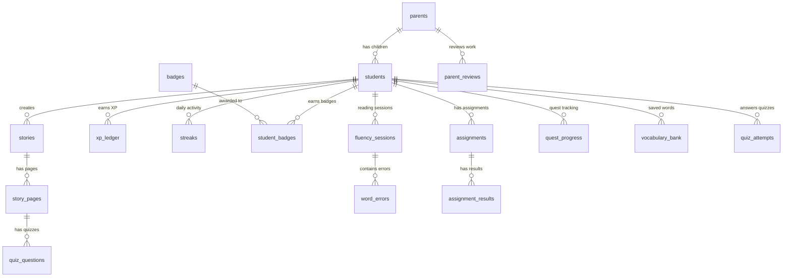

# Database Schema

> **Dev**: SQLite via `aiosqlite` · **Prod**: Supabase PostgreSQL via `asyncpg`
> All primary keys are `UUID(as_uuid=False)` — stored as text strings, NOT native UUID.
> The `database.py` auto-converts `postgres://` → `postgresql+asyncpg://` connection strings.

## Entity Relationship Diagram

---

## Tables

### `parents`
| Column | Type | Constraints | Notes |
|--------|------|------------|-------|
| `id` | UUID (text) | PK | **Supabase auth.users UUID** — set on signup |
| `first_name` | VARCHAR(50) | NOT NULL | |
| `last_name` | VARCHAR(50) | NOT NULL | |
| `created_at` | TIMESTAMP | DEFAULT now() | |

> ⚠️ `parents.id` is the Supabase auth user UUID — no FK to auth.users (managed by Supabase).

---

### `students`
| Column | Type | Constraints | Notes |
|--------|------|------------|-------|
| `id` | UUID (text) | PK | Auto-generated |
| `parent_id` | UUID (text) | FK → parents.id, NULLABLE | Supabase auth UUID |
| `name` | VARCHAR(100) | NOT NULL | Child's display name |
| `grade_level` | INTEGER | NOT NULL | 0 (K) through 8 |
| `school` | VARCHAR(100) | NULLABLE | Optional |
| `avatar_url` | TEXT | NULLABLE | Profile picture URL |
| `pin_hash` | TEXT | NULLABLE | Kid login PIN (hashed) |
| `created_at` | TIMESTAMP | DEFAULT now() | |

> ⚠️ `parent_id` has no DB-level FK to `auth.users` — it's a logical reference. The `students.parent_id` → `parents.id` relationship exists at the application level.

---

### `stories`
| Column | Type | Constraints | Notes |
|--------|------|------------|-------|
| `id` | UUID (text) | PK | |
| `student_id` | UUID (text) | FK → students.id | Who created it |
| `title` | TEXT | NOT NULL | AI-generated title |
| `grade_level` | INTEGER | NOT NULL | |
| `theme` | TEXT | NOT NULL | Freeform — can be long scene descriptions |
| `cover_media_url` | TEXT | NULLABLE | First page image or dedicated cover |
| `metadata` | JSON | NULLABLE | Extra data (mapped as `metadata_` in Python) |
| `is_sel_story` | BOOLEAN | DEFAULT false | Social-emotional learning story |
| `sel_tags` | JSON | NULLABLE | e.g. `["bullying", "empathy"]` |
| `sel_reflections` | JSON | NULLABLE | AI reflection prompts |
| `story_mode` | VARCHAR(20) | DEFAULT 'free_play' | `free_play` \| `quest` |
| `created_at` | TIMESTAMP | DEFAULT now() | |

---

### `story_pages`
| Column | Type | Constraints | Notes |
|--------|------|------------|-------|
| `id` | UUID (text) | PK | |
| `story_id` | UUID (text) | FK → stories.id | |
| `page_number` | INTEGER | NOT NULL | 1-indexed |
| `content` | TEXT | NOT NULL | Page text |
| `media_url` | TEXT | NULLABLE | Gemini-generated illustration URL |
| `word_count` | INTEGER | DEFAULT 0 | Computed from `len(content.split())` |

---

### `quiz_questions`
| Column | Type | Constraints | Notes |
|--------|------|------------|-------|
| `id` | UUID (text) | PK | |
| `story_page_id` | UUID (text) | FK → story_pages.id | Links quiz to specific page |
| `question` | TEXT | NOT NULL | |
| `choices` | JSON | NOT NULL | Array of 4 strings |
| `correct_answer` | VARCHAR(200) | NOT NULL | Must match one of `choices` |
| `explanation` | TEXT | NULLABLE | Kid-friendly explanation |

---

### `quiz_attempts`
| Column | Type | Constraints | Notes |
|--------|------|------------|-------|
| `id` | UUID (text) | PK | |
| `student_id` | UUID (text) | FK → students.id | |
| `question_id` | UUID (text) | FK → quiz_questions.id | |
| `answer` | VARCHAR(200) | NOT NULL | Student's selected choice |
| `is_correct` | BOOLEAN | DEFAULT false | |

---

### `xp_ledger`
| Column | Type | Constraints | Notes |
|--------|------|------------|-------|
| `id` | UUID (text) | PK | |
| `student_id` | UUID (text) | FK → students.id | |
| `amount` | INTEGER | NOT NULL | XP earned |
| `reason` | VARCHAR(100) | NOT NULL | e.g. `page_read`, `book_complete` |
| `earned_at` | TIMESTAMP | DEFAULT now() | |

> XP values: `page_read=5`, `quiz_correct=10`, `quiz_attempt=3`, `book_complete=50`, `daily_login=15`

---

### `badges`
| Column | Type | Constraints | Notes |
|--------|------|------------|-------|
| `id` | UUID (text) | PK | |
| `slug` | VARCHAR(50) | UNIQUE, NOT NULL | e.g. `first_book`, `streak_3` |
| `name` | VARCHAR(100) | NOT NULL | Display name |
| `icon` | VARCHAR(10) | NOT NULL | Emoji |
| `description` | TEXT | NOT NULL | |
| `criteria` | JSONB | DEFAULT '{}' | Unlock conditions |

**Seeded badges** (8 core, inserted idempotently on startup):

| Slug | Criteria |
|------|----------|
| `first_book` | `{"stories_read": 1}` |
| `streak_3` | `{"streak_days": 3}` |
| `streak_7` | `{"streak_days": 7}` |
| `quiz_master` | `{"quiz_correct": 5}` |
| `speed_reader` | `{"speed_minutes": 10}` |
| `explorer` | `{"unique_themes": 3}` |
| `bookworm` | `{"stories_read": 5}` |
| `word_wizard` | `{"level": 3}` |

---

### `student_badges`
| Column | Type | Constraints | Notes |
|--------|------|------------|-------|
| `id` | UUID (text) | PK | |
| `student_id` | UUID (text) | FK → students.id | |
| `badge_id` | UUID (text) | FK → badges.id | |
| `earned_at` | TIMESTAMP | DEFAULT now() | |

---

### `streaks`
| Column | Type | Constraints | Notes |
|--------|------|------------|-------|
| `id` | UUID (text) | PK | |
| `student_id` | UUID (text) | FK → students.id | |
| `active_date` | DATE | NOT NULL | One row per day the student reads |

> Streak length is calculated by counting consecutive days backward from today.

---

### `reading_progress`
| Column | Type | Constraints | Notes |
|--------|------|------------|-------|
| `id` | UUID (text) | PK | |
| `student_id` | UUID (text) | FK → students.id | |
| `story_id` | UUID (text) | FK → stories.id | |
| `pages_read` | INTEGER | DEFAULT 0 | (SQLAlchemy model) |
| `completed` | BOOLEAN | DEFAULT false | (SQLAlchemy model) |
| `completed_at` | TIMESTAMP | NULLABLE | |

> ⚠️ The Supabase SQL version has `last_page`, `total_pages`, `updated_at` columns and a `UNIQUE(student_id, story_id)` constraint. The SQLAlchemy model has `pages_read` and `completed` instead. Be aware of this mismatch.

---

### `reading_logs` (Supabase only — no SQLAlchemy model)
| Column | Type | Notes |
|--------|------|-------|
| `id` | UUID | PK, auto |
| `student_id` | UUID | NOT NULL |
| `story_id` | UUID | FK → stories.id |
| `story_title` | VARCHAR(255) | |
| `grade_level` | INTEGER | |
| `cover_url` | TEXT | |
| `student_name` | VARCHAR(100) | |
| `reading_accuracy` | INTEGER | |
| `quiz_score` | INTEGER | |
| `quiz_total` | INTEGER | |
| `comprehension_score` | INTEGER | |
| `total_xp` | INTEGER | |
| `stars` | INTEGER | 1-3 |
| `feedback` | TEXT | |
| `completed_at` | TIMESTAMPTZ | DEFAULT now() |

> Written to directly via `supabase.from('reading_logs').insert()` from the frontend. No backend route.

---

### `fluency_sessions`
| Column | Type | Constraints | Notes |
|--------|------|------------|-------|
| `id` | UUID (text) | PK | |
| `student_id` | UUID (text) | FK → students.id | |
| `story_id` | UUID (text) | FK → stories.id | |
| `page_number` | INTEGER | NOT NULL | |
| `words_per_minute` | FLOAT | NULLABLE | |
| `accuracy_pct` | FLOAT | DEFAULT 0.0 | |
| `total_words` | INTEGER | DEFAULT 0 | |
| `correct_words` | INTEGER | DEFAULT 0 | |
| `feedback` | TEXT | NULLABLE | AI-generated encouragement |
| `recorded_at` | TIMESTAMP | DEFAULT now() | |

---

### `word_errors`
| Column | Type | Constraints | Notes |
|--------|------|------------|-------|
| `id` | UUID (text) | PK | |
| `session_id` | UUID (text) | FK → fluency_sessions.id | |
| `word` | TEXT | NOT NULL | Expected word from story |
| `spoken_word` | TEXT | NULLABLE | What the child actually said |
| `error_type` | VARCHAR(20) | NOT NULL | `mispronounced` \| `skipped` \| `repeated` |
| `word_index` | INTEGER | NOT NULL | Position in page text (0-indexed) |

---

### `vocabulary_bank`
| Column | Type | Constraints | Notes |
|--------|------|------------|-------|
| `id` | UUID (text) | PK | |
| `word` | TEXT | INDEXED | The vocabulary word |
| `definition` | TEXT | NOT NULL | Kid-friendly definition |
| `example_sentence` | TEXT | NOT NULL | |
| `pronunciation_url` | TEXT | NULLABLE | TTS audio URL |
| `grade_level` | INTEGER | NOT NULL | |
| `story_id` | UUID (text) | FK → stories.id, NULLABLE | Source story |
| `student_id` | UUID (text) | FK → students.id, NULLABLE | Owner (NULL = shared) |
| `is_saved` | BOOLEAN | DEFAULT false | Student saved to personal bank |

---

### `assignments`
| Column | Type | Constraints | Notes |
|--------|------|------------|-------|
| `id` | UUID (text) | PK | |
| `student_id` | UUID (text) | FK → students.id | |
| `title` | TEXT | NOT NULL | |
| `description` | TEXT | NOT NULL | |
| `assignment_type` | VARCHAR(30) | DEFAULT 'mixed' | `vocabulary` \| `fluency` \| `comprehension` \| `mixed` |
| `content` | JSON | DEFAULT [] | Array of `{type, prompt, options?, correct_answer?}` |
| `source` | VARCHAR(20) | DEFAULT 'ai_generated' | `ai_generated` \| `parent_created` |
| `difficulty_level` | INTEGER | DEFAULT 1 | |
| `status` | VARCHAR(20) | DEFAULT 'pending' | `pending` \| `in_progress` \| `completed` \| `reviewed` |
| `due_date` | TIMESTAMP | NULLABLE | |
| `source_story_id` | UUID (text) | FK → stories.id, NULLABLE | |
| `source_session_id` | UUID (text) | FK → fluency_sessions.id, NULLABLE | |
| `created_at` | TIMESTAMP | DEFAULT now() | |

---

### `assignment_results`
| Column | Type | Constraints | Notes |
|--------|------|------------|-------|
| `id` | UUID (text) | PK | |
| `assignment_id` | UUID (text) | FK → assignments.id | |
| `student_id` | UUID (text) | FK → students.id | |
| `answers` | JSON | DEFAULT {} | Student answers keyed by task index |
| `score_pct` | FLOAT | DEFAULT 0.0 | |
| `completed_at` | TIMESTAMP | DEFAULT now() | |

---

### `quest_levels`
| Column | Type | Constraints | Notes |
|--------|------|------------|-------|
| `id` | UUID (text) | PK | |
| `level_number` | INTEGER | UNIQUE | 1-indexed |
| `name` | VARCHAR(100) | NOT NULL | e.g. "Reading Rookie" |
| `description` | TEXT | NOT NULL | |
| `required_stories` | INTEGER | DEFAULT 1 | Stories needed to advance |
| `min_accuracy_pct` | FLOAT | DEFAULT 60.0 | |
| `min_quiz_pct` | FLOAT | DEFAULT 60.0 | |
| `min_assignment_score` | FLOAT | DEFAULT 60.0 | |
| `badge_slug` | VARCHAR(50) | NULLABLE | Badge to award on completion |
| `xp_reward` | INTEGER | DEFAULT 100 | |

---

### `quest_progress`
| Column | Type | Constraints | Notes |
|--------|------|------------|-------|
| `id` | UUID (text) | PK | |
| `student_id` | UUID (text) | FK → students.id, UNIQUE | One row per student |
| `current_level` | INTEGER | DEFAULT 1 | |
| `stories_completed` | INTEGER | DEFAULT 0 | Within current level |
| `avg_accuracy` | FLOAT | DEFAULT 0.0 | |
| `avg_quiz_score` | FLOAT | DEFAULT 0.0 | |
| `avg_assignment_score` | FLOAT | DEFAULT 0.0 | |
| `unlocked_at` | TIMESTAMP | DEFAULT now() | |
| `updated_at` | TIMESTAMP | DEFAULT now() | Auto-updated |

---

### `parent_reviews`
| Column | Type | Constraints | Notes |
|--------|------|------------|-------|
| `id` | UUID (text) | PK | |
| `parent_id` | UUID (text) | NOT NULL | Supabase auth UUID |
| `student_id` | UUID (text) | FK → students.id | |
| `assignment_id` | UUID (text) | FK → assignments.id, NULLABLE | |
| `fluency_session_id` | UUID (text) | FK → fluency_sessions.id, NULLABLE | |
| `star_grade` | INTEGER | NOT NULL | 1-5 stars |
| `comment` | TEXT | NULLABLE | |
| `reviewed_at` | TIMESTAMP | DEFAULT now() | |

---

## Important Notes

1. **Badge seeding** happens in `database.py:_seed_badges()` on every server startup using raw SQL `INSERT ... ON CONFLICT DO NOTHING`.
2. **Table creation** uses `Base.metadata.create_all(checkfirst=True)` — it won't drop existing data.
3. **`reading_progress` schema mismatch**: The Supabase SQL defines `last_page`/`total_pages` columns, but the SQLAlchemy model uses `pages_read`/`completed`. The frontend writes directly to Supabase using `last_page`/`total_pages`.
4. **`reading_logs` has no SQLAlchemy model** — it's created via Supabase SQL and accessed directly from the frontend via `supabase.from('reading_logs')`.
